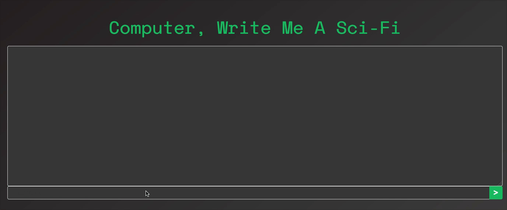

# Sci-fi NN

After reading about [how amazing LSTM and Word2Vec are at Natural Language Processing](http://colah.github.io/posts/2014-07-NLP-RNNs-Representations/) and taking a few online courses on Neural Network basics - I decided I had to try it out for myself. But, with any machine learning / NN modeling project what data to use and where to get it are always some of the biggest questions of the whole project. Luckily for me Project Guteberg exists.
## Get the data:
[Project Gutenberg's](https://www.gutenberg.org/) public domain library of books is an incredible resource for all kinds of books and their [catalogue of Science Fiction](https://www.gutenberg.org/wiki/Science_Fiction_(Bookshelf)) is no exception. They've even collected most of the materials into a downloadable CD, which, since we're looking for lots of Sci-Fi to base the neurnal network on, is exactly what we need.

## Combine the data:
Ok, well not quite 'exactly what we need' - the txt files that you get as part of the collection have a few issues for us to deal with. They're not all in English, they have lots of transcriber's notes and legal liscences attached, and each book is a separate file.
In order to get our data ready for the project these were issues I had to deal with. Since each file said its language near the top of the file - going through and deleting all non-English files was pretty trivial. 

The transcription notes and legal notices on the other hand proved a bit too stubborn for me to automate their removal - since many had different formats, locations, and content - the lack of consistancy made it easier to just remove this info by hand.

For the final bit of data manipulation I wanted to combine the separate works into three files to use in the training, validating, and testing - this was easy enough to manage with a little python file combiner I've creatively called [`fileCombiner.py`](fileCombiner.py).

With our three training files ready to go (you can see the training file [here](input_data/combined.train.txt)) - we could now move on to the actual model creation work.

## Long Short-Term Memory (LSTM): 
To begin, I knew I wanted to use an LSTM RNN to build my text generator model - they're ['unreasonably effective'](http://karpathy.github.io/2015/05/21/rnn-effectiveness/), especially when it comes to language processing.

So where better to begin than with a [basic tensorflow example tutorial](https://towardsdatascience.com/lstm-by-example-using-tensorflow-feb0c1968537) that reviews each word in the sample data in order to predict the next word in a series.

After following the tutorial I came up with this version: [`lstm.py`](previous_versions/lstm.py)


_Throughout this work I used the [collected works of Herman Melville](input_data/moby.train.txt) as a proof of concept data set - it's large enough to cause some difficulty without being the insane 40MB of my collected Sci-fi data set._
### 6 hours of training and ...

    all the things of I I Bartleby, I I Bartleby, I I Bartleby, I I Bartleby, I I Bartleby, I I Bartleby,

Ok, so that's not the masterpiece I was hoping for, but it is doing _something_. Which is a start.

I wanted to be able to save all this glorious progress, so I added the ability to save to `lstm.py `. I turns out, however, that saved Tensorflow models are less useful than I'd hoped - **they can't be loaded into tensorflow.js**. So a new plan was needed.
## Switching to Keras:

Unlike barebones Tensorflow - Keras has some built in model saving methods that can be used to for tensorflow.js once the model is fully trained. Additionally Keras is stacked with a ton of syntactic sugar to make the code for model training clearer and easier.

Yet again we started [with a tutorial](http://adventuresinmachinelearning.com/keras-lstm-tutorial/).

This tutorial resulted in the barebones of what became my current modeling code ([localKeras.py](localKeras.py)). It also introduced me to a new method of training on a single data set: Epochs.

Epochs are a single pass over the data set - the bigger the data set the longer a single epoch takes - with the expectation that a model can be trained repeatedly over the same data to get better results. So, whereas my initial LSTM training took 6 hours to train - we can now get better results by training for much much longer.

As you may guess - this also presents us with a new problem - if the 'resonably sized' data set took 6 hours for one epoch and the sci-fi data set is 10 times bigger - **a single epoch of sci-fi data would take 60 hours on a CPU**. Since our goal is now multiple epochs this CPU won't cut it.

So let's try using a few GPUs.

## Take it to the (Google) Cloud:
Since I didn't actually have access to a few GPUs - I turned to the cloud.

Luckily I still had money left on my Google Cloud free trial. So let's find a guide to using Keras on the cloud.

http://liufuyang.github.io/2017/04/02/just-another-tensorflow-beginner-guide-4.html

Again, as is the theme of this project, there was a gotcha. Since keras, unlike tensorflow, doesn't work with google cloud's ML out of the box, it took a bit of work to get it running. The trick ended up being having to convert my keras.py into a module folder `kerasLSTM` complete with a `cloudml-gpu.yaml` settings file.

So with the full weight of 3 GPUs in my corner - we were good to go.

### 40 hours of training -> ~4 epochs :

    '"white "white <eos> "white...' 
This is ~9% accurate, I guess

So, I'd likely need to train it much much longer (ideally around 50 epochs), but I don't have 500 free GPU hours on Google Cloud nor the equivalent $200 to spare, so we need another option.

## Character Based Keras:

Many of the [initial LSTM example blogs](http://karpathy.github.io/2015/05/21/rnn-effectiveness/) I had read used a [character based learning](https://chunml.github.io/ChunML.github.io/project/Creating-Text-Generator-Using-Recurrent-Neural-Network/) as opposed to the word based method I'd been trying. Since it had been effective for them I decided to give it a try.

Character based training had a few advantages over word based training:

- The number of variables to train on dropped from several thousand (words) to less than one hundred (characters)
- Since there's a lot fewer input variables the training time can be _much_ shorter
- It removes the need to remove punctuation and carriage returns from the training

On first run, the character method immediately proved itself superior - training a full epoch in about an hour with a resultant accuracy above 10%. Now we're getting somewhere.


## Proof of Concept trained on the writings of Melville:

As with the word based trainings I decided to use the works of Melville as an initial proof of concept text sample and began running the training in ernest.

### 1 epoch:
    the stranger of the sailors of the sailors of the sailors of the stranger of the stranger of the stranger of the stranger of the stranger of

### 26 epochs (~60% Categorical Accuracy):
    THE COMMODORE OF THE STRANGER IN A MAN-OF-WAR.


    The ship was a sort of considerable concern to the sea, the ship's company were seated by

### 50 epochs (~65% Categorical Accuracy):
    The master-at-arms ashore has been seen at the main-mast, and the sailors were all the sailors who had been seen at the main-mast

### 61 has the highest categorical accuracy so far (as of epoch 100) -> 65.41%

    is the Captain of the officers of the Purser's Steward as a common sailor, and the sailors were set forth in the ship's boat, and the same strange strict and solemn of the sea and the same strange strip of a strange sort of state as the same strange strip of state as the ship is almost a sort of strange dog the same thing to be a sort of state of sea-waters

## Begin Training on Sci-fi Data - Target Accuracy ~65%
The training data for the Melvile works above was about 3.5Mb and each epoch took about 50 min. The sci-fi data is considerably bigger - 12.7Mb (which is reduced from the originaly planned 40mb) so each epoch takes about 4 hours.

### The Trouble with NaN
When trying to train on the sci-fi with the same params - (seq length - 140, batch length - 20, two lstm layers etc.) Training would get to a certain point (usually 35% accuracy) and the loss would change to `NaN` and the accuracy would plummet.

To avoid needlessly running the training with a `NaN` value for loss Keras has a nice helper function you can bind as a callback to `model.fit` called `TerminateOnNaN` which saves the model and stops training if the loss becomes `NaN`.

But, just stopping my training isn't the goal - so I changed the optimization method (adadelta -> adam -> rmsprop), activation methods (softmax -> relu -> both), the batch size (140 -> 30 -> 50), the step size (20 -> 128), the ammount of data normalization (0 -> 3 -> 1) and in the end found a combination that got past the 35% accuracy mark (without NaN for the loss). Each data set can be a bit different, so these might require some adjustment for other text data.

It seems the NaN issue is some combination of the learning rate, the batch size, and the momentum (determined by the optimization method) - I can decrease the learning rate or increase the batch size as the epoch increases in order to avoid getting NaN. Momentum trains faster, but can also lead to "hill climbs" where the loss rate increases rather than decreases.

### 1 Epoch (~51% accurate):
    and the strange strange strange straight things that had been a strange strange strange strange strange strange straight through the strange

### 10 Epochs (~62% Categorical Accuracy):
    "Well, there is a strange thing to the stars, and the cadets were all right. The cadets were all right, and the cadets were all right

### 40 Epochs (63.7% Accurate):
    "Well, then, sir," said Tom. "I was a spaceman in the stars and the stars which was the same thing to the stars and the stars were all right
Seeded with "It all began with" :

    It all began with a smile. "We're all right, but I don't know what they were doing about it."

    "What about the same thing is the matter with the stars and 

### 101 Epochs (65.2% Accurate):
    Wicked Statisticalist Party, and the statement of the colonists were allowed to see the stars and the stars were allowed to see the stars 

### 121 Epochs (66.4%):
    The only thing that happened to be a man of the Solar System. It was a strange thing that the sun was still there. The sun was still stretching.


## 369 Epochs (67%) with an Improved Generator:

As I neared and surpassed my initial accuracy target (65%) I was still a bit disatisfied by the generator's tendency to get itself stuck in loops (`'see the stars and the stars were allowed to see the stars'`) and its preference for the letter 's'.

After reviewing [how others had handled this problem](https://medium.com/@david.campion/text-generation-using-bidirectional-lstm-and-doc2vec-models-1-3-8979eb65cb3a), I figured sampling the predictions would present the type of output I was looking for. My sampling function, given a `rate` and a prediction `array` would use `log`, `exp`, and normalization (by dividing by total) to create an array of probabilities.

```python
    # Modify the prediction array by temp - to avoid always picking the best prediction
    # Higher temp will result in more varied prediction results
    preds = np.asarray(preds).astype('float64')
    # ignore the log of zero issues
    np.seterr(divide='ignore')
    preds = np.log(preds) / temperature
    # reenable the warn
    np.seterr(divide='warn')
    exp_preds = np.exp(preds)
    # Normalize the probability inputs
    preds = exp_preds / np.sum(exp_preds)
```
Using this array of probabilities for each character we simply use a multinomial to roll some dice and pick a winner:
``` python
    probabilities = np.random.multinomial(1, preds, 1)
    return np.argmax(probabilities)
```

In the end, with a sampling rate of `0.4`, I ended up with something like this:


    CHAPTER II

    A second later, the sun stood before him, then took the recording of the
    voice of the panthers, and the water started on to the
    air, looking around and began to scream across the atmosphere.

    The car shot back to the earth, the last weapon give it to
    the first three of the barbarians in their shadows and seats had been pursuing and beautiful
    from the crowd of green colours. The shape of the southern
    hemisphere became a mere bright face that carried on
    their tracks and the counters of the full moon.

    "But why don't you rise another direction?" the socio

    narrowed the paratime ship and raised his arm from the controls. He was a few small glasses.
    He had done the story from the earth. The Professor suggested that the water was still twenten the electric galley and the mass of the same as those somewhat dead leaf, and which had been the most important except to support them.

    "Your spirit is finished."

    "What else have you done the same?" 
    "The great planet is a good word of that thing as the scene of the air
    light that had been the professor and the sun which was sinned and hard and seemed to wait till they were in
    any case. The sky was all the mornings are strewn with short windows. The boy standing on the steps he was unable
    to put another of the past and her people have a chance to see the constant contemptuous beam as the sound of the earth was concerned and the best thing that had been so precisely seen there was no help, and the doctor made the world as ourselves of the speed of the barbecue and planning as the discoverer was able to pick out a recording to the construction of the
    handle of their conversation. Her brother was a shadow from the surface and the walls rolled it upon them,
    came through a scrap of stars and shells, and the heat was
    the strange beauty of the telescope to the side of
    the room for several moments. I have seen those things that were there. There was not a strange report, and the other side of the collection of the negative country

## The Wall that 67% Built

After training for hours and hours (to epoch 500) it's pretty clear that my current method/data set aren't going to make a model with an accuracy much higher than 67%

While this still beats my initial goal of 65% accuracy - it still leaves a lot to be desired. Rather than sticking to my LSTM model method I tried a few additional layer types and combinations before admitting defeat:

#### Bidirectional? ❌

What could be better than a single direction LSTM? A two direction LSTM? 

A bidirectional LSTM takes its input data and runs it both forwards and backwards to predict the next (and previous) character in the sequence. Which should, in theory, give a better picture of the data set we're trying to replicate. [Others had used this method](https://medium.com/@david.campion/text-generation-using-bidirectional-lstm-and-doc2vec-models-1-3-8979eb65cb3a) with a similar goal with some pretty solid results. 

For my data, however, it only gave me lots of false positives. My accuracy measurements went up to up to 97%, but both the validation results (those checked against non-training data) and the generation results were terrible. The model tended to generate something like:

    She She She She She She She She

It's possible this method lends itself better to a word based training, but for our purposes it was a dead end.

#### GRU? ❌ 

Gated Recurrent Units (GRUs) are similar to LSTM, but have only two gates to manage variable memory. This means that GRUs should train faster ([Empirical Evaluation of Gated Recurrent Neural Networks on Sequence Modeling](https://arxiv.org/pdf/1412.3555v1.pdf)) and perform better if there is a single output ([Efficiently applying attention to sequential data with the Recurrent Discounted Attention unit](https://openreview.net/forum?id=BJ78bJZCZ)). For my data, however, a GRU based system trained and converged slower than the LSTM version.

#### Change the Optimizer (again) ✅ 

In the end the only modification that helped at all was a further tweaking of the optimizer, momentum, and learning rate. As [this paper](https://yerevann.github.io/2016/06/26/combining-cnn-and-rnn-for-spoken-language-identification/) showed - starting with one optimizer (`Adadelta`) for the first few epochs to speed up convergence and then switching to another (`SGD`) to avoid too many "hill climbs" or `NaN` issues can squeeze out a bit more accuracy.

## Loading into tensorflow.js:
Once I had a model I was fairly satisfied with -  It was time to move on to phase two - turning this awful machine learning model into an awful web app. Thanks to Keras - the model I had trained was readily convertable to JSON for use with tensorflow.js - or so I thought.

Tensorflow.js ships with a converter to enable conversion from keras:
```bash
pip install tensorflowjs
tensorflowjs_converter --input_format keras \
                       path/to/my_model.hdf5 \
                       path/to/tfjs_target_dir
```
Which is great in principle, but in practice it didn't work. There was an isue with my weights not loading into tensorflow (this turned out to be the same issue as below), but even once I got the loading to work the model initialization brought my browser to a crawl. 

### There's got to be a better way!

So, what else is there? Keras-js, although depreciated in February, has it's own conversion method (that makes smaller model files than tensorflowjs) and doesn't seem to make the browser melt. 

But even this library didn't solve all my problems. Out of the box - keras-js had the same issue as tensorflowjs of my model weights not linking to the layers. Thankfully, since the converter was written in python, a few changes on my end and I had a converter that the browser could actually read.

Since keras-js is no longer supported and keras is on a newer version - the wrapper layers also don't behave when loaded, so I ended up forking keras-js, fixing the wrappers, and re-publishing it as `ibexian-keras-js`.

```bash
npm install ibexian-keras-js
python node_modules/ibexian-keras-js/python/encoder.py  ./final_model.hdf5
```

To load these into JS you only need to import ibexian-keras-js and the `final_model.bin`.
```javascript
import KerasJS from 'ibexian-keras-js'
const model = new KerasJS.Model({
    filepath: 'final_model.bin'
});
model.ready().then(() => { Do Something })
```

### Save the output of `generateText` as JSON
#### Reversed Dictionary
```javascript
{0: ' ', 1: 'e', 2: 't', 3: 'a', 4: 'o', 5: 'n', 6: 'i', 7: 'h', 8: 's', 9: 'r', 10: 'd', 11: 'l', 12: 'u', 13: '\n', 14: 'c', 15: 'm', 16: 'f', 17: 'w', 18: 'g', 19: 'y', 20: 'p', 21: ',', 22: 'b', 23: '.', 24: 'v', 25: '"', 26: 'k', 27: 'I', 28: '-', 29: 'T', 30: "'", 31: 'A', 32: 'S', 33: 'H', 34: 'x', 35: 'W', 36: 'B', 37: '?', 38: 'M', 39: 'C', 40: ';', 41: 'j', 42: '!', 43: 'N', 44: 'R', 45: 'q', 46: 'z', 47: 'L', 48: 'P', 49: 'D', 50: 'O', 51: 'E', 52: 'F', 53: 'Y', 54: 'G', 55: 'V', 56: '_', 57: 'K', 58: 'J', 59: '0', 60: ':', 61: 'U', 62: '*', 63: '1', 64: 'Z', 65: '2', 66: 'X', 67: '8', 68: '`', 69: '3', 70: '5', 71: '4', 72: '(', 73: ')', 74: '6', 75: '9', 76: '7', 77: 'Q', 78: '#', 79: '[', 80: ']', 81: '�', 82: '@', 83: '/', 84: '=', 85: '{', 86: '}', 87: '$', 88: '&', 89: '\\', 90: '~', 91: '^', 92: '+', 93: '<', 94: '>'}
```
#### Char_To_ID
```javascript
{'z': 46, '!': 42, 'K': 57, '1': 63, ')': 73, '/': 83, 'A': 31, '3': 69, 'I': 27, '=': 84, '(': 72, 'Y': 53, '#': 78, 'J': 58, 'c': 14, 'O': 50, 'C': 39, 'h': 7, 'w': 17, '\n': 13, '"': 25, '}': 86, 'x': 34, '8': 67, 'r': 9, '^': 91, 'Z': 64, '<': 93, '5': 70, ',': 21, '+': 92, 'U': 61, 'P': 48, 'B': 36, '[': 79, 'G': 54, '*': 62, ':': 60, '$': 87, 'e': 1, 's': 8, 'm': 15, 'H': 33, '&': 88, '\\': 89, 'W': 35, 'Q': 77, 'X': 66, '~': 90, 'u': 12, 'k': 26, 'D': 49, ' ': 0, '-': 28, ';': 40, '2': 65, '�': 81, 'i': 6, "'": 30, 'q': 45, 'R': 44, 'v': 24, 't': 2, 'g': 18, 'E': 51, 'V': 55, 'j': 41, '@': 82, '`': 68, 'S': 32, '.': 23, 'n': 5, '7': 76, '4': 71, 'd': 10, '>': 94, '6': 74, 'T': 29, ']': 80, '?': 37, '9': 75, '_': 56, 'a': 3, 'b': 22, '0': 59, '{': 85, 'y': 19, 'F': 52, 'N': 43, 'M': 38, 'p': 20, 'o': 4, 'L': 47, 'l': 11, 'f': 16}
```

## [Computer, Write me a Sci-fi](https://github.com/Ibexian/writeMeAScifi)
Based on the above model work I've made [a small web app](https://william.kamovit.ch/writeMeAScifi/) that slowly (and I do mean slowly) generates text based on user input.

This app - built on parcel, numjs, keras-js, and others - mimics the `generateScifi.py` script in this repo - only slower and in the browser.



Did I mention how slow it is?

### One Final Problem
When I first put the app online the predictions became terrible (more garbled than normal) - I
tried:
- Removing the sampling (thinking it was the math libs getting corrupted)
- Moving the final_model.bin out of parcel (thinking the .bin was being garbled)
- In the end it seems that keras-js was breaking when parcel minimized it for the web 
